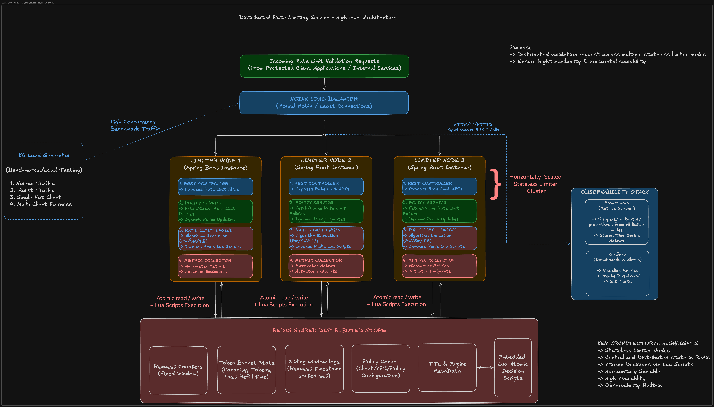

# Distributed Rate Limiting Service

## Overview

A distributed rate limiting system being built using Spring Boot and Redis to enforce API request quotas across scalable backend services.

Current implementation includes:
- Spring Boot REST APIs
- Fixed Window rate limiting algorithm
- Configurable in-memory policies
- Per-client + per-API request throttling

---

## Architecture Diagram



Editable version:
[Open in Excalidraw](https://excalidraw.com/#json=euAq5qziIBuD7gbBwefY8,m70cVKbQbdPVi85_vI7yHA)

---

## Current Features

- Fixed Window rate limiting
- Configurable API policies
- Request quota enforcement
- HTTP 429 response for rejected requests
- Structured request/response DTOs
- Layered Spring Boot architecture

---

## Example API

### Request

```http
POST /api/v1/rate-limit/check